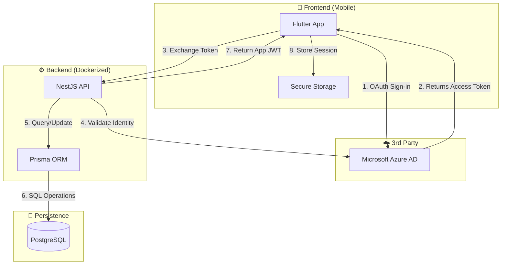

# 📍 i-Hudur — Organization Overview

**i-Hudur** is a secure, cross-platform attendance and appointment system designed to modernize workplace tracking. It combines a high-performance Flutter mobile client with a robust NestJS backend, leveraging QR code technology and Microsoft Entra ID (Azure AD) for seamless security.

---

## 🏛 System Architecture

The system operates on a client-server architecture where the mobile app serves as the primary interface for employees and administrators, while the backend centralizes logic, data persistence, and access control.

### High-Level Interaction Diagram



---

## 🔌 Component Communication

### 1. Frontend ↔ Backend (REST API)

The **Flutter** mobile application communicates with the **NestJS** backend via a RESTful API.

* **Protocol:** HTTPS (secure) or HTTP (local dev).
* **Client:** Uses `dio` for networking with interceptors for automatic token injection.
* **Payloads:** JSON-based request/response bodies.
* **Authentication:** Bearer Token (JWT) issued by the backend after successful Microsoft login.

### 2. Backend ↔ Database (Prisma ORM)

The backend uses **Prisma** as an Object-Relational Mapper (ORM) to interact with the database.

* **Type Safety:** Auto-generated TypeScript types ensure database queries match the schema.
* **Connection:** via TCP to the Dockerized PostgreSQL container.

### 3. Backend ↔ Microsoft (3rd Party)

Microsoft Azure Active Directory acts as the **Identity Provider (IdP)**.

* **Role:** Handles user authentication and organizational verification.
* **Graph API:** The backend may optionally query Microsoft Graph to fetch additional user details (job title, department) to enrich the local profile.

---

## 🐳 Infrastructure & DevOps

The core infrastructure is designed to be portable and container-ready.

### PostgreSQL in Docker

The database runs as an isolated service within a Docker container, ensuring consistent environments across development and production.

* **Image:** `postgres:latest` (or specific version defined in `docker-compose.yml`)
* **Volume:** Persistent data storage ensures data survives container restarts.
* **Network:** backend and database share a private Docker bridge network.

### CI/CD Pipelines

We utilize **GitHub Actions** to maintain code quality across the stack:

* **Mobile Pipeline:** Runs `flutter analyze` and widget tests on every push.
* **Backend Pipeline:** Runs `ESLint`, `Prettier`, and E2E tests using a temporary test database.

---

## 🔮 Future Improvements & Roadmap

To further enhance the *Presence* ecosystem, the following features are planned:

### 📱 Frontend Enhancements

* **Offline Mode:** Cache QR scans locally when internet is unstable and sync when online.
* **Push Notifications:** Notify employees of successful check-ins or missed checkout reminders.
* **Biometric Auth:** Use FaceID/Fingerprint to unlock the app instead of re-logging in.

### ⚙️ Backend Evolutions

* **Web Admin Portal:** A React/Next.js dashboard for HR to view detailed analytics and export CSV reports.
* **Geo-Fencing:** Optional validation to ensure QR scans only happen within physical office coordinates.
* **WebSocket Integration:** Real-time dashboard updates for Admins (watch attendance happen live).

---

## 📂 Repository Structure

```text
presence-root/
├── mobile/                  # Flutter Application
│   ├── lib/                 # Dart Source Code
├── backend/                 # NestJS API
│   ├── src/                 # TypeScript Source Code
│   ├── prisma/              # DB Schema
│   └── docker-compose.yml   # Infrastructure
└── README.md                # (This File)
```
